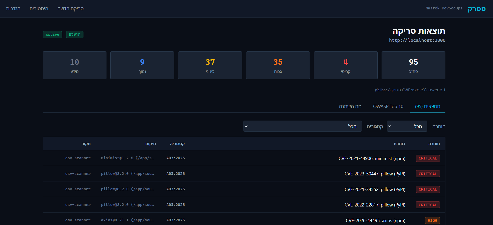
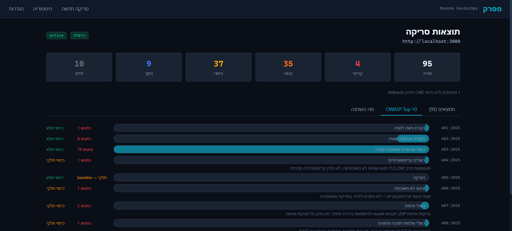
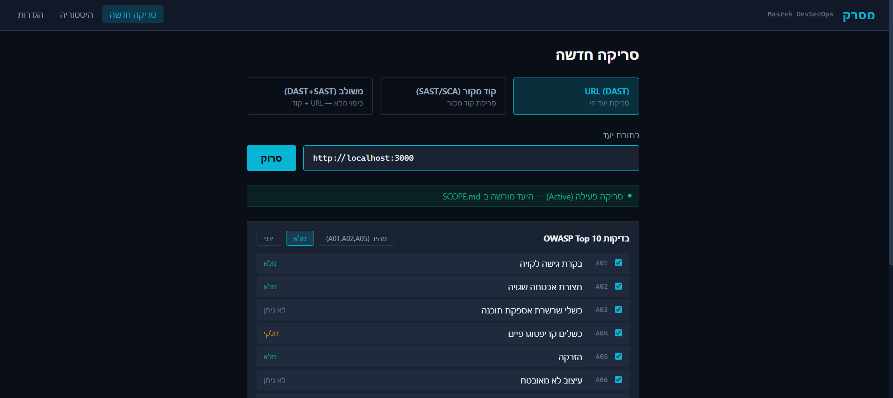

# Masrek — מסרק

**Automated DAST + SAST security scanner mapping findings to OWASP Top 10:2025.**

[](https://github.com/dyfroman/masrek/actions/workflows/sast.yml)


## What is this?

Masrek ("comb" in Hebrew) is a DevSecOps platform that orchestrates industry-standard security scanners — both dynamic (DAST) and static (SAST/SCA) — deduplicates their findings across tools, and maps every result to the OWASP Top 10:2025 taxonomy. It's honest about what it can and can't detect: each OWASP category reports its actual detectability level, so you know where automated coverage ends and human review begins.

<!-- TODO: screenshot of main dashboard with scan results -->


## Key Features

- **DAST scanning** — ZAP (spider + active scan), nuclei (template-based), nikto (web server audit), with passive checks (HTTP headers, TLS, robots.txt) for any reachable host
- **SAST/SCA scanning** — semgrep (code patterns), osv-scanner (lockfile CVEs), trivy (dependencies + IaC misconfig), gitleaks (hardcoded secrets)
- **Combined runs** — a single scan that exercises both DAST and SAST layers, producing unified OWASP coverage in one report
- **Full OWASP Top 10:2025 mapping** — every finding maps to a 2025 category via CWE (exact match), OWASP metadata tags (translated across 2017/2021/2025 editions), or best-fit fallback. The mapping method is recorded per finding so you know how confident the classification is
- **Honest detectability** — each OWASP category reports whether it's fully testable, partially testable, or not testable by the current tool set. Categories that need human review say so; no category is falsely marked "clean"
- **Cross-tool deduplication** — findings from different scanners for the same issue (e.g., osv-scanner and trivy both reporting the same CVE) merge into one finding with both tools credited
- **Secret redaction** — secret values are redacted at parse time before they reach the database. Gitleaks findings store only the secret type, file location, and a type-identifying prefix — never the raw value
- **CI/CD shift-left** — SAST gates every push/PR on critical severity; DAST runs nightly. A fixture self-test job verifies the scanners still detect known vulnerabilities
- **Scope enforcement** — active scans are only permitted against targets explicitly authorized in `SCOPE.md`. Out-of-scope targets are refused at the API level

<!-- TODO: screenshot of OWASP Top 10 coverage tab showing detectability badges -->


## Responsible Use & Authorization

Masrek runs **active security scans** — tools that send probing requests, inject test payloads, and fingerprint services. This is powerful and useful when pointed at systems you're authorized to test. It is illegal when pointed at systems you're not.

**Only scan targets you own or have explicit written permission to test.**

This isn't a disclaimer — it's a design principle enforced in the code:

- **`SCOPE.md`** is the single source of truth for scan authorization. URLs must appear in the allowlist to be actively scanned. Source paths must appear in the source allowlist for SAST scanning.
- The backend **refuses** active scans against targets not in scope, even if explicitly requested via the API.
- The DAST CI workflow **hardcodes** its target to the local authorized Juice Shop instance. There is no input parameter that could point it at an arbitrary URL.
- Private/reserved IP addresses are blocked for out-of-scope targets (SSRF defense-in-depth).

Active scanning of third-party infrastructure without authorization may violate computer fraud laws (CFAA, CMA, or local equivalents). Passive checks (HTTP headers, TLS inspection) are equivalent to normal browser traffic and are permitted against any reachable host.

## Architecture

```
                         docker compose
  ┌───────────────────────────────────────────────────────┐
  │                                                       │
  │  ┌──────────────┐     ┌───────────┐                   │
  │  │  juice-shop   │     │    ZAP    │                   │
  │  │  :3000        │◄────│   :8080   │  (REST API)      │
  │  │  (demo target)│     │           │                   │
  │  └──────────────┘     └─────▲─────┘                   │
  │                             │                         │
  │  ┌──────────────────────────┴───────────────────────┐ │
  │  │            backend (FastAPI) :8000                │ │
  │  │                                                  │ │
  │  │  DAST orchestrator ──► run-all.sh                │ │
  │  │    ZAP API, nuclei, nikto, headers/TLS           │ │
  │  │                                                  │ │
  │  │  SAST orchestrator ──► run-sast.sh               │ │
  │  │    osv-scanner, trivy, semgrep, gitleaks          │ │
  │  │                                                  │ │
  │  │  Parsers ──► OWASP mapping ──► Dedup ──► SQLite  │ │
  │  └──────────────────────────────────────────────────┘ │
  │                                                       │
  │  ┌──────────────────────────────────────────────────┐ │
  │  │          frontend (React/Vite) :5173             │ │
  │  │    Dashboard · OWASP coverage · Scan launcher    │ │
  │  └──────────────────────────────────────────────────┘ │
  │                                                       │
  └───────────────────────────────────────────────────────┘
       source/ ──► mounted read-only for SAST (:ro)
```

**Data flow:** Scanners produce JSON → parsers extract findings and map to OWASP 2025 categories → dedup merges duplicates across tools (via content hash) → findings are stored in SQLite → the API serves them to the dashboard with severity counts, detectability badges, and per-category grouping.

## OWASP Top 10:2025 Coverage

| Category | Name | Coverage | Tools | Notes |
|----------|------|----------|-------|-------|
| A01 | Broken Access Control | DAST | ZAP, nuclei | Path traversal, IDOR, access control misconfig |
| A02 | Security Misconfiguration | Both | ZAP, nuclei, nikto, semgrep, gitleaks | Headers, TLS, exposed secrets, code-level misconfig |
| A03 | Software Supply Chain Failures | SAST/SCA | osv-scanner, trivy | Lockfile CVEs, dependency vulnerabilities |
| A04 | Cryptographic Failures | Both | testssl.sh, ZAP, trivy | TLS config, weak crypto in dependencies |
| A05 | Injection | Both | ZAP, nuclei, semgrep | XSS, SQLi, SSTI, SSRF, eval/exec patterns |
| A06 | Insecure Design | **Partial** | semgrep | Code patterns only; architectural design flaws require human review |
| A07 | Authentication Failures | Both | ZAP, nuclei, semgrep, gitleaks | Default creds, hardcoded secrets, auth bypass |
| A08 | Software & Data Integrity | **Partial** | trivy | Dependency integrity + IaC/CI misconfig; build pipeline tampering and SRI require human review |
| A09 | Logging & Alerting Failures | **Partial** | semgrep | Missing logging patterns; log infrastructure adequacy requires human review |
| A10 | Mishandling Exceptional Conditions | DAST | ZAP, nuclei | Error disclosure, unhandled exceptions |

Categories marked **Partial** are honest about their limitations. Masrek detects what automated tools can detect — it does not claim to replace human security review for architectural or design-level concerns.

## Tech Stack

| Layer | Technology |
|-------|-----------|
| Backend | Python 3.12, FastAPI, SQLite |
| Frontend | React 18, TypeScript, Vite, Tailwind CSS |
| DAST | ZAP 2.x (REST API), nuclei 3.3.7, nikto, testssl.sh |
| SAST/SCA | semgrep 1.168.0, osv-scanner 1.9.1, trivy 0.71.0, gitleaks 8.30.1 |
| Infrastructure | Docker Compose, GitHub Actions |

## Getting Started

### Prerequisites

- [Docker Desktop](https://www.docker.com/products/docker-desktop/) (with Docker Compose)
- ~4 GB free RAM (Juice Shop + ZAP + backend + frontend)

### Run

```bash
git clone https://github.com/dyfroman/masrek.git
cd masrek
docker compose up -d --build
```

| Service | URL |
|---------|-----|
| Dashboard | http://localhost:5173 |
| Backend API | http://localhost:8000 |
| Juice Shop (demo target) | http://localhost:3000 |

### Run a scan

1. Open the dashboard at **http://localhost:5173**
2. The default target `http://localhost:3000` (Juice Shop) is pre-authorized in `SCOPE.md`
3. Select a scan type — **URL** (DAST), **Source** (SAST), or **Combined** (both)
4. Choose OWASP categories and scan depth
5. Launch the scan and watch results populate in real time

<!-- TODO: screenshot of scan launcher with combined mode selected -->


## CI/CD

Masrek implements shift-left security with two GitHub Actions workflows:

### SAST (`sast.yml`) — every push and PR

- Scans product code with osv-scanner, trivy, semgrep, and gitleaks (pinned versions matching the backend container)
- Parses results through the same backend parsers used in production — ensuring consistent OWASP mapping and secret redaction
- **Gates on critical severity only.** High findings (e.g., dev-image non-root hardening, dependencies without an available patch) are reported in the workflow summary and build artifacts but do not block the build. This is a deliberate risk-management choice to keep CI actionable while maintaining full visibility.
- Uploads redacted results as build artifacts (raw gitleaks output is deleted before upload)

### DAST (`dast.yml`) — nightly + manual

- Runs on a nightly schedule (02:00 UTC) and via manual `workflow_dispatch`
- Spins up Juice Shop + ZAP via Docker Compose, runs the DAST orchestrator against the authorized local target
- Report-only — serves as a scheduled security audit, not a PR blocker
- Manual dispatch allows choosing baseline (~2 min) or full active scan (~30 min)

### Fixture self-test

A separate CI job scans `source/vulnerable-app` and asserts it finds known vulnerabilities. If the scanners stop detecting what they should, this job fails — it's a smoke test for the scanning pipeline itself.

## Note on the Vulnerable Fixture

The `source/vulnerable-app/` directory contains intentionally vulnerable code (insecure dependencies, hardcoded secrets, eval patterns). It exists as a demo scan target to show Masrek's detection capabilities across all OWASP categories.

This fixture is:
- **Excluded** from the CI gate (so it doesn't make every build red)
- **Scanned** by the platform's own demo runs (it's the SAST target in combined scans)
- **Verified** by the fixture-selftest CI job (which passes when vulns are found)

Do not "fix" the vulnerabilities in this directory — they are intentional.

## Roadmap

- [ ] Non-root container hardening (backend + frontend Dockerfiles)
- [ ] SBOM download from the dashboard (trivy already generates CycloneDX data)
- [ ] PR comment integration (post finding summary as a GitHub PR comment)
- [ ] Additional DAST target profiles beyond Juice Shop
- [ ] Historical trend charts (finding counts over time)

## Author

**Daniel Froman**

[GitHub](https://github.com/dyfroman) · [LinkedIn](https://www.linkedin.com/in/daniel-froman-89b2b7241/) · [dyfroman@gmail.com](mailto:dyfroman@gmail.com)

## License

MIT

